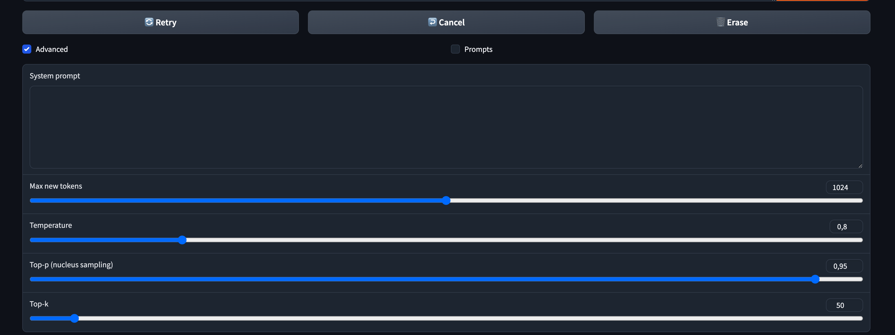
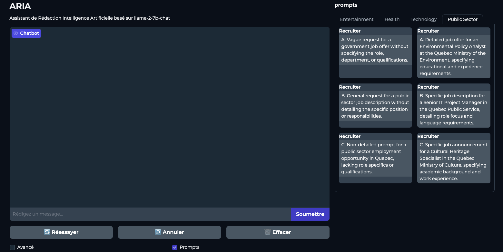

# Inference from a user interface using Gradio

## Architecture

1. **Frontend**: Gradio
2. **Backend**: `llama2-wrapper` (a wrapper for the `llama.cpp` backend)

## Setup

**Step 1: Clone this repository**

`git clone https://github.com/jaslatendresse/llm-demo.git`

**Step 2: Navigate to the repository's folder and workspace**

`cd llm-demo/demo-ui`

**Step 3: Set up local environment**

```
wget https://github.com/conda-forge/miniforge/releases/latest/download/Miniforge3-MacOSX-arm64.sh

bash Miniforge3-MacOSX-arm64.sh

export PATH="/home/<YOUR_COMPUTER_USERNAME>/miniforge3/bin:$PATH"
```

This step will install Conda with the Miniforge installer (specific to ARM64 architectures) and ink the `conda` command to this installation. 

**Step 4: Create and activate the virtual environment**

```
conda create --name py310 python=3.10

conda activate py310
```

This will create a virtual environment with Python 3.10 named "py310" and activate it.

**Step 5: Setting up the backend**

We must manually install the backend dependency to specify that we want the backend to use metal acceleration. 

```
pip uninstall llama-cpp-python -y

CMAKE_ARGS="-DLLAMA_METAL=on" FORCE_CMAKE=1 pip install -U llama-cpp-python --no-cache-dir

pip install 'llama-cpp-python[server]'
```

**Step 6: Install other dependencies**

`pip install -r requirements.txt`

**Step 7: Download the model**

Inside the folder `demo-ui`, create a folder named `models`. 

Download the model `llama-2-7b-chat-gguf` on [HuggingFace](https://huggingface.co/TheBloke/Llama-2-7B-Chat-GGUF/blob/main/llama-2-7b-chat.Q4_0.gguf).

Put the model in the `demo-ui/models` folder. 

**All the commands for this can be found in `demo-ui/commands.txt`, just make sure to put your own username in the path.**

## Execution

From the folder `demo-ui`, execute the command: 

`python app.py` or `python3 app.py`. 

Navigate to http://127.0.0.1:7860 to start talking with the model. 

## Important note

To adjust the number of GPU layers accordingly, you can do so by changing the value in `demo-ui/llama2_wrapper/model.py` on line 30. 

The current value is set at 8, which should be optimal for this setup, but you may need to change it depending on your hardware. 

## Model parameters

Some of the **model parameters** can be changed from the UI by selecting the "Advanced" box: 



"Max new tokens" indicates the number of tokens received in the model's response. 

"Temperature" allows to control the randomness of the response. A lower temperature will result in more deterministic outputs while a higher temperature will result in more random (or creative) outputs. The default value is 0.8.

"Top-p" is a parameter that allows the model to restrict its choices to the top "k" most probable next tokens at each step of generation. The probability distribution is truncated to keep only the top "k" options, from which the next word is sampled. This approach reduces the likelihood of generating improbable words, enhancing coherence but potentially limiting creativity. The default value is 0.95.

"Top-k" selects the smallest set of words whose cumulative probability exceeds the threshold "p". This set, or "nucleus", varies in size at each step. The model then samples from this dynamically sized set. This method balances diversity and coherence more adaptively, as it considers the shape of the probability distribution rather than a fixed number of words. The default value is 50. 

More details on this can be found in `demo-terminal/README/`. 

**Pre-set prompts** have been included to show the model's capabilities. They can be accessed through the UI by clicking on the "Prompts" box:



These prompts can be modified in `demo-ui/prompts/prompts.csv`. They are separated in groups of topics, namely "Entertainment", "Health", "Technology". As seen in the screenshot above, each prompt has two versions: a minimal prompt and a more detailed prompt. This is to show how the formulation of the prompt can affect a model's output. They are each annotated by a letter so that "code knows" which prompt of the "better equivalent" of which. This is purely for demonstration purposes. 

`demo-ui/prompts/utils.py` takes care of sorting those prompts in the UI. 


